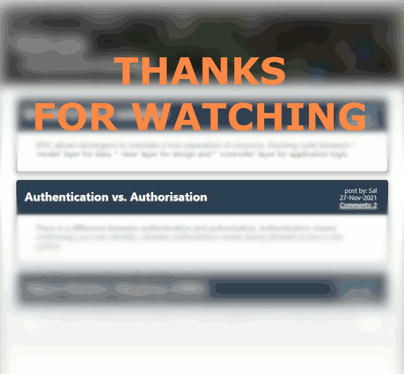

# USYD-FSF Week14 Project
## MVC - Model View Controller Tech Blog

### Table of Contents  
  
   1. [Project Description](#1-description)
   2. [Application Features](#2-features)
   3. [Installation](#3-installation)
   4. [Usage](#4-usage)
   5. [Credits](#5-credits)
   6. [License](#6-license)
   7. [Repository Status](#7-github-repo-status)
   8. [Contribute](#8-how-to-contribute)
   9. [Tests](#9-tests)
   10. [Checklist](#10-checklist)

---
### 1. Description  
**What is this project?**  
* My build of a CMS-style blog site, similar to a Wordpress site, where developers can publish their blog posts and comment on other developers’ posts as well. Built completely from scratch and deploed on Heroku. The app follows the MVC paradigm in its architectural structure, using Handlebars.js as the templating language, Sequelize as the ORM, and the express-session npm package for authentication.

* Technologies used are BCrypt, Heroku, Sequelize, MySQL database, Node.js, Express.js and dotenv.

**Why this project?**  
* Demonstrates development skills in the 'full stack' discipline as the creation of the application is both client side and server side.


**What problem does this project solve?**  
* Interactive environment that manages user data on an external database.  Uses cryptology to securely manage users passwords.

**Lessons learnt?**  
* I had a number of Git merge issues due to uploading my SQL credential file, Git Guardian did it's job but then I couldn't get the main branch and my test branch to align.  Ended up removing the repository and rebuilding it - this time just working from the main branch.  I need to work out a better solution for future conflicts like this.
* Wanted to add a Tech News Feed and found a good API but then learnt server side code does not recognise Fetch commands without a Fetch package installed.  Ended up working it out and very happy with the result.  It was a lot of effort but I think it was worth it to make the blog a bit more interesting / dynamic.  
* The server side Fetch call sends the data to client as a string - it didn't seem to recognise the res.json( data ) request as the data arrived as a string.  Weirdly I needed to run JSON.parse( data ) twice to get the client side response data to convert to an object.  The first JSON.parse(data) didn't appear to change anything as testing with typeof command returned 'string' but magically after a 2nd parse it converted.  I will need to find out why the data needed to be parsed twice before it would convert to an object.  Despite all of the data handling it appears to happen almost instantly.  The data handling is along the lines of:  
  1. Client side initiates a server route using a Fetch call when user navigates to the dashboard page (note: user needs to be logged in).
  2. Application's server side makes call to a News server / API.
  3. Application's server responds back to Client side with the News package (sent as a string in JSON format);
  4. Client side receives the News package and converts the news data into an object.
  5. Client side handles the data and renders the user's browser with the news.
* Learnt to read the Heroku error log, with the guidance of BCS (my 1st time using BCS), discovered that the following declaration was added into my postRouter.js controller file:  
```
const { required } = require(‘yargs’);
```
I didn't add the declaration.  It was suggested that sometimes VS Code will automatically make amendments like this to 'assist'.  The problem was that this one line was causing a problem with Heroku compiling the application for runtime and also was not needed.  It was a simple fix, deleting the line of code, but caused a lot of headaches, had I gone to the log file first then time to fix would have been faster.
* Heroku's handling of the different Environment variables / log in credentials / API keys is configured from the Heroku application dashboard.  I thought Heroku needed the .env file but you simply configure the required environment parameters in the application's dashboard - located under the Settings tab / page - Config Vars.  You click the 'Reveal Config Vars button and you can add as many environment variables as needed.  


---
### 2. Features  
Features provided:

* All features requested by the client have been implemented:  
  * a CMS-style blog site where a user can publish articles, blog posts, and my thoughts and opinions.
  * visiting the site for the first time, the user is presented with the homepage, which includes existing blog posts if any have been posted; navigation links for the homepage and the dashboard; and the option to log in.
  * Clicking on the homepage option, takes the user to the homepage.  Click on any other links in the navigation prompts the user to either sign up or sign in.
  * Choosing to sign up prompts the user to create a username and password.
  * Clicking on the sign-up button, saves the user credentials and logs the user into the site.
  * Revisiting the site at a later time and choosing to sign in, prompts the user to enter their username and password.
  * When the user is signed in to the site, they see navigation links for the homepage, the dashboard, and the option to log out.
  * Clicking on the homepage option in the navigation, takes the user to the homepage and presents them with existing blog posts that include the post title and the date created.
  * Clicking on an existing blog post presents the user with the post title, contents, post creator’s username, and date created for that post and have the option to leave a comment.
  * Entering a comment and clicking on the submit button while signed in saves the comment and the post is updated to display the comment, the comment creator’s username, and the date created.
  * Clicking on the dashboard option in the navigation takes the user to the dashboard and presents them with any blog posts they have already created and the option to add a new blog post.
  * Clicking on the button to add a new blog post prompts the user to enter both a title and contents for their blog post. Click on the button to create a new blog post saves the title and contents of the user's post and takes them back to an updated dashboard with their new blog post.
  * If the user clicks on one of their existing posts in the dashboard, they are given the option to delete or update their post and afterwards they are taken back to an updated dashboard
  * Clicking on the logout option in the navigation, signs the user out of the site.
  * If the user is logged in and is idle on the site for more than a set time, they are able to view comments but are prompted to log in again before can adding, updating, or deleting posts.
* In addition to the above I've added a Technology news feed to the user's dashboard so they can get inspired by the latest Technology news being reported.
* The application is deployed on Heroku and functions as above.  Access to the application is by navigating to the URL: [tech-yes](https://tech-yes.herokuapp.com/).

---  
  
#### Screengrab

 


---
### 3. Installation  
You can download the source code from [my Github repository](https://github.com/Mark33Mark/tech-yes) and unzip the files to a location on your computer.  To run the application locally you will need to type in your terminal / command line: npm install for the dependencies, create a mySQL database by logging into your mySQL and running the schema.sql file located in the db folder.  Good idea to seed the database as well, typing in the command line: npm run seed.

---

### 4. Usage  
The code can be downloaded from [my Github repository](https://github.com/Mark33Mark/tech-yes) for all assets created for the project.  
You can modify the code as you need.

---
### 5. Credits  
There are no particular call outs for this assignment, all code was used with reference to the unit 14 Activities.

---
### 6. License  
 The works in this repository are subject to:  

[](doc/LICENSE.md)

---
### 7. Github repo status  

 
 

---
### 8. How to Contribute
 If you would like to contribute, please comply with the Contributor Covenant Code of Conduct:  

[](doc/code_of_conduct.md)

---
### 9. Tests  
- No unit tests have been prepared for this project.  Testing has been done on my desktop running different scenarios.

---
### 10. Checklist  
 All actions not checked are still to be completed:

[x]  All features expressed above in [2. Features](#2-features)  
[x]  Application's folder structure follows the Model-View-Controller paradigm.
[x]  Uses express-handlebars package to implement Handlebars.js for the Views.
[x]  Application is deployed to Heroku.
[x]  Application is live with URL: [https://tech-yes.herokuapp.com/](https://tech-yes.herokuapp.com/)  
[x]  GitHub repository containing your application code: [https://github.com/Mark33Mark/tech-yes](https://github.com/Mark33Mark/tech-yes)  
[x]  Application loads with no errors.
[x]  User experience is intuitive and easy to navigate. The UI has a clean an polished style.  The application resembles the mock-up functionality provided in the homework instructions.
[x]  The GitHub repository contains all the application code.  
[x]  Repository has a unique name; follows best practice for file structure; and naming conventions.  
[x]  The application resembles the mock-up functionality provided in the assigment instructions.  
[x]  Repository follows best practices for class/id naming conventions, indentation, quality comments, etc.  
[x]  Repository contains multiple descriptive commit messages.  
[x]  Repository contains a README file with description, screenshot and link to deployed application.  

---

- [Back to the top](#usyd-fsf-week14-project)